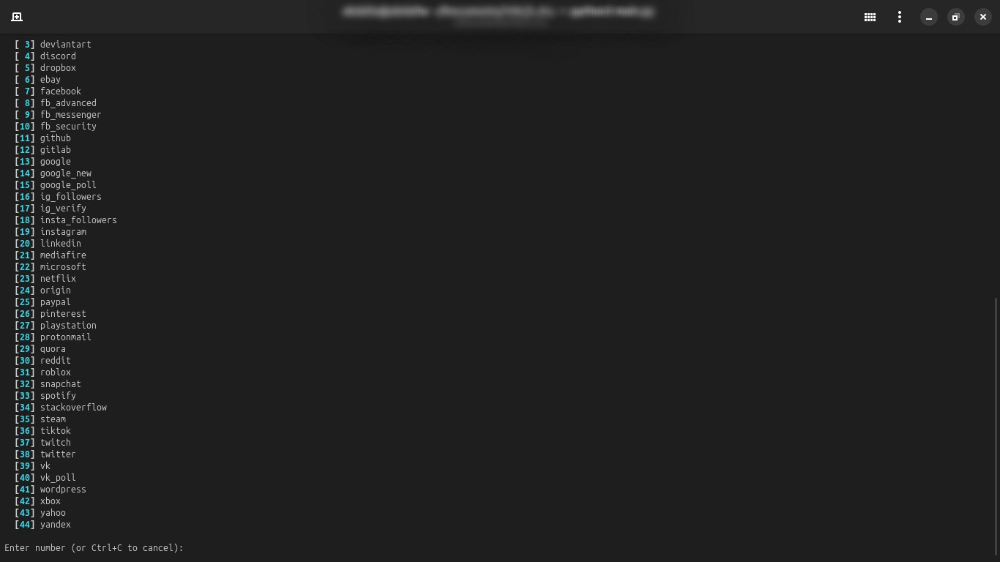
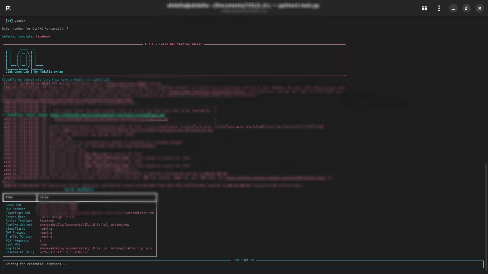

# L.O.L | Link-Open-Lab

```text
 _      ____   _
| |    / __ \ | |
| |   | |  | || |
| |   | |  | || |
| |___| |__| || |____
|______\____/ |______|
```

[](https://www.python.org/)
[](https://www.php.net/)
[](https://www.gnu.org/licenses/gpl-3.0)
[-111827>)](https://github.com/dx0rz)

Professional Unified Phishing Simulation & Security Auditing Framework by Abdalla Omran (dx0rz).

## Elevator Pitch

L.O.L is a unified, automation-first framework designed for controlled phishing simulation, form-flow analysis, and defensive security auditing in authorized lab environments. It combines Python orchestration, PHP template execution, and optional cloud tunnel exposure into one streamlined developer experience.

## Core Architecture

L.O.L orchestrates three layers seamlessly:

1. Python Control Plane
   : Service orchestration, proxying, monitoring, NDJSON event normalization, and live dashboard rendering.
2. PHP Execution Layer
   : Template runtime served from published content in `.lol_runtime/www`.
3. Tunnel Bridge (Optional)
   : Public URL provisioning via cloudflared or ngrok for controlled remote testing.

This architecture provides a reproducible end-to-end workflow with minimal manual setup.

## F34TUR3 SH0WC4S3

- 🛡️ Real-time proxying and request inspection
- 🎭 30+ pre-built templates from `.sites`
- ☁️ Optional cloudflared/ngrok tunneling with live URL capture
- 📡 Live dashboard with local/public endpoints and service status
- 🧾 Compact NDJSON capture pipeline (one event per line)
- 🧠 Smart credential-like field extraction for security analysis
- 🧰 Docker-ready runtime for portable execution
- 🔔 Optional Telegram status/alert notifications

## Requirements

- Python 3.12+
- PHP CLI
- cloudflared (optional)
- ngrok (optional)

## Installation (From Scratch)

### 1. Clone repository

```bash
git clone https://github.com/dx0rz/L.O.L.git
cd L.O.L
```

### 2. Create virtual environment (recommended)

```bash
python3 -m venv .venv
source .venv/bin/activate
python3 -m pip install --upgrade pip
python3 -m pip install -r requirements.txt
```

### 3. Validate setup

```bash
python3 main.py --list-sites
```

### 4. Start framework

```bash
python3 main.py
```

## First Run Experience

When you launch L.O.L:

1. Choose tunnel mode (Local only / cloudflared / ngrok) from the interactive prompt.
2. Pick a template from the interactive list.
3. L.O.L publishes it to `.lol_runtime/www`.
4. PHP backend + Python monitor start automatically.
5. If a tunnel mode is enabled, a public URL is captured.
6. Live captures are rendered in the dashboard panel in real time.

## Professional CLI Reference

| Flag                   | Description                                         |
| ---------------------- | --------------------------------------------------- |
| `--project-root`       | Set workspace root directory.                       |
| `--sites-dir`          | Set template library directory (default: `.sites`). |
| `--site`               | Select a specific template to serve.                |
| `--list-sites`         | List available templates and exit.                  |
| `--php-host`           | PHP bind host.                                      |
| `--php-port`           | PHP bind port.                                      |
| `-p`, `--port`         | Legacy alias for `--php-port`.                      |
| `--monitor-host`       | Proxy/dashboard bind host.                          |
| `--monitor-port`       | Proxy/dashboard bind port.                          |
| `--traffic-log-file`   | NDJSON output path for captured traffic.            |
| `--cloudflared-url`    | Explicit cloudflared target URL override.           |
| `--cloudflared`        | Enable cloudflared public tunnel mode.              |
| `--ngrok`              | Enable ngrok public tunnel mode.                    |
| `--php-router`         | Optional PHP router script path.                    |
| `--telegram-bot-token` | Optional Telegram bot token.                        |
| `--telegram-chat-id`   | Optional Telegram chat id.                          |
| `-c`, `--show-auth`    | Print credential-like data from log and exit.       |
| `-i`, `--show-ip`      | Print unique client IPs from log and exit.          |

## Command Examples

```bash
python3 main.py --site instagram
python3 main.py --monitor-port 8081 --php-port 8001
python3 main.py --cloudflared
python3 main.py --ngrok
python3 main.py --show-auth --traffic-log-file traffic_log.json
python3 main.py --show-ip --traffic-log-file traffic_log.json
```

Notes:

- If no tunnel flag is passed, L.O.L shows an interactive tunnel chooser first.
- Local-only mode is still available from the chooser.
- `--cloudflared-url` is used only with `--cloudflared`.
- `--ngrok` is routed through the monitor/proxy so POST capture and live dashboard updates stay active.

## Logging Format (NDJSON)

Each capture event is stored as one JSON line:

```json
{
  "timestamp": "2026-03-19T00:00:00Z",
  "site": "yahoo",
  "user": "example@mail.com",
  "pass": "example-password"
}
```

## Visuals

The screenshots below illustrate the default operator flow and dashboard experience.




## Docker

```bash
docker build -t lol-link-open-lab:release .
docker run --rm lol-link-open-lab:release python3 main.py --list-sites
```

## Troubleshooting

### `externally-managed-environment` during pip install

Use a virtual environment:

```bash
python3 -m venv .venv
source .venv/bin/activate
python3 -m pip install -r requirements.txt
```

### `php: command not found`

```bash
sudo apt install php-cli
```

### cloudflared URL not appearing

- Ensure `cloudflared` is installed and executable.
- Ensure you started the framework with `--cloudflared`.
- Restart and wait a few seconds for tunnel initialization.

### ngrok URL not appearing

- Ensure `ngrok` is installed and available in `PATH`.
- Ensure you started the framework with `--ngrok`.
- Ensure ngrok is authenticated:

```bash
ngrok config add-authtoken <YOUR_TOKEN>
```

## Legal Warning

**This project is strictly for educational, authorized testing, and defensive security research. Unauthorized deployment, phishing abuse, credential theft, or testing without explicit permission is prohibited. You are solely responsible for legal compliance in your jurisdiction. The lead developer, Abdalla Omran (dx0rz), disclaims liability for misuse or unlawful operation.**

## Security & Privacy Best Practices

- Never commit `.lol_runtime/` or runtime logs.
- Sanitize screenshots before publishing.
- Mask local usernames, tunnel URLs, and captured credentials.
- Keep Telegram tokens and chat IDs out of source control.

## Maintainer

Lead Developer: Abdalla Omran (dx0rz)

## License

GPL-3.0. See `LICENSE`.
